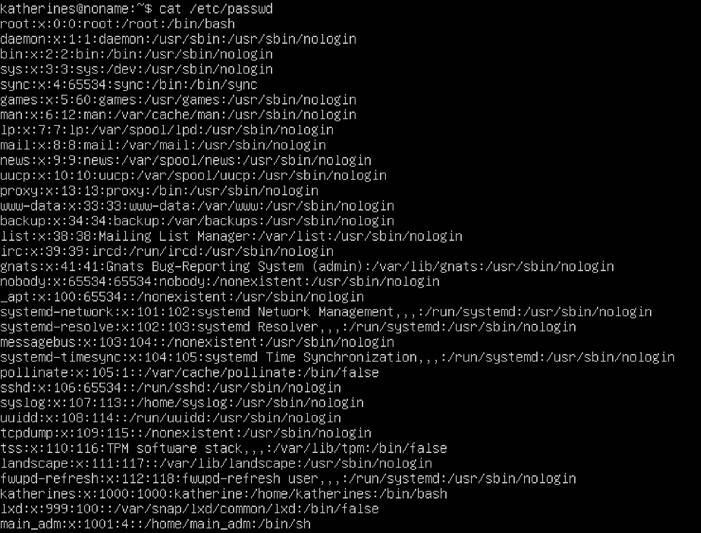
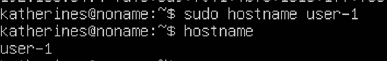
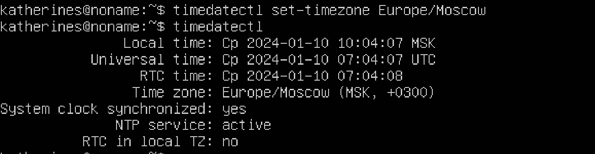
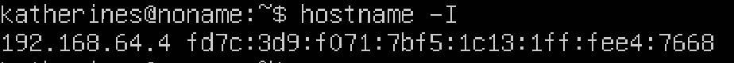
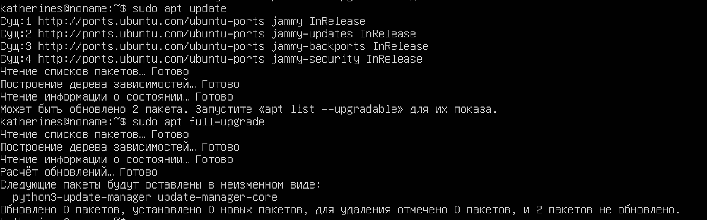

## Part 1. Установка ОС
**== Задание ==**

##### Установить **Ubuntu 20.04 Server LTS** без графического интерфейса. (Используем программу для виртуализации - VirtualBox)

- Графический интерфейс должен отсутствовать.

- Узнайте версию Ubuntu, выполнив команду \
`cat /etc/issue.`
- Вставьте скриншот с выводом команды.

**== Решение ==**
- ``Смотрим версию Ubuntu ``<br>
<br>


## Part 2. Создание пользователя

**== Задание ==**

##### Создать пользователя, отличного от пользователя, который создавался при установке. Пользователь должен быть добавлен в группу `adm`.

- Вставьте скриншот вызова команды для создания пользователя.
- Новый пользователь должен быть в выводе команды \
`cat /etc/passwd`
- Вставьте скриншот с выводом команды.

**== Решение ==**

- ``Создаём пользователя и добавляем в группу adm ``<br>
<br>

- ``Вывод списка пользователей ``<br>
<br>

## Part 3. Настройка сети ОС

**== Задание ==**

##### Задать название машины вида user-1  
##### Установить временную зону, соответствующую вашему текущему местоположению.  
##### Вывести названия сетевых интерфейсов с помощью консольной команды.
- В отчёте дать объяснение наличию интерфейса lo.  
##### Используя консольную команду получить ip адрес устройства, на котором вы работаете, от DHCP сервера. 
- В отчёте дать расшифровку DHCP.  
##### Определить и вывести на экран внешний ip-адрес шлюза (ip) и внутренний IP-адрес шлюза, он же ip-адрес по умолчанию (gw). 
##### Задать статичные (заданные вручную, а не полученные от DHCP сервера) настройки ip, gw, dns (использовать публичный DNS серверы, например 1.1.1.1 или 8.8.8.8).  
##### Перезагрузить виртуальную машину. Убедиться, что статичные сетевые настройки (ip, gw, dns) соответствуют заданным в предыдущем пункте.  

- В отчёте опишите, что сделали для выполнения всех семи пунктов (можно как текстом, так и скриншотами).
- Успешно пропинговать удаленные хосты 1.1.1.1 и ya.ru и вставить в отчёт скрин с выводом команды. В выводе команды должна быть фраза "0% packet loss".

**== Решение ==**

- ``Создание новой машины и вывод в терминал ``<br>
<br>

- ``Установка временной зоны и вывод информации``<br>
<br>

- ``Установка набора сетевых подключений``<br>
<br>
- ``Вывод названий сетевых интерфейсов``<br>
<br>

- Loopback-интерфейс (обычно обозначается как lo) в Linux - это своего рода виртуальный сетевой интерфейс, который всегда присутствует в системе. Его главное предназначение - обеспечивать внутреннюю коммуникацию на уровне сетевого стека на одном устройстве.С этим интерфейсом всегда связан адрес 127.0.0.1. У него есть dns-имя – localhost.

- ``Получение IP адреса от DHCP сервера``<br>
<br>

- DHCP- Dynamic Host Configuration Protocol (протокол динамической настройки узла, позволяющий устройствам автоматически получать IP-адрес)

- ``Получение внешнего IP``<br>
<br>

- ``Внутренний IP-адрес шлюза, ip-адрес по умолчанию``<br>
<br>

#### Настройка IP: 
- Зададим статичные (заданные вручную, а не полученные от DHCP сервера) настройки ip, gw, dns (используя публичные DNS серверы, например 1.1.1.1 или 8.8.8.8). DHCP автоматически присваивает устройству IP, поэтому сначала необходимо отключить облачную инициализацию. 

- ``1. Нужно открыть файл конфигурации subiquity-disable-cloudinit-networking.cfg в каталоге /etc/cloud/cloud.cfg.d/
``<br>
<br>

- ``2. Откроем файл конфигурации netplan в текстовом редакторе vim с помощью команды: sudo vim /etc/netplan/00-installer-config.yaml
``<br>
<br>

- `` Зададим статические настройки: изменим параметр dhcp4 на значение false, в addresses укажем статический IP-адрес: 192.168.1.45/24, и в gateway4 зададим внутренний IP-адрес 192.168.1.1. В параметре addresses раздела nameservers укажем публичные серверы. ``<br>
<br>

- ``Для применения изменений используем команду:``<br>
<br>

- ``Перезагрузим виртуальную машину командой reboot и проверяем сохранились ли выставленные вручную настройки:``<br>
<br>

- ``Пропингуем удаленные хосты 1.1.1.1 и ya.ru:``<br>
<br>
<br>


## Part 4. Обновление ОС
**== Задание ==**

##### Обновить системные пакеты до последней на момент выполнения задания версии.  

- После обновления системных пакетов, если ввести команду обновления повторно, должно появится сообщение, что обновления отсутствуют.
- Вставить скриншот с этим сообщением в отчёт.

**== Решение ==**


- `` Обновление системных пакеты до последней на момент выполнения задания версии.``<br>
- ``Команды : ``<br>
    ```
    sudo apt update
    sudo apt full-upgrade
    ```

- `` После обновления системных пакетов видим, что при повторном введении двух последних команд получены сообщения об отсутствии новых обновлений``<br>
<br>

## Part 5. Использование команды sudo
**== Задание ==**

##### Разрешить пользователю, созданному в [Part 2](#part-2-создание-пользователя), выполнять команду sudo.

- В отчёте объяснить *истинное* назначение команды sudo (про то, что это слово - "волшебное", писать не стоит).  
- Поменять hostname ОС от имени пользователя, созданного в пункте [Part 2](#part-2-создание-пользователя) (используя sudo).
- Вставить скрин с изменённым hostname в отчёт.

**== Решение ==**


- ``Разрешить пользователю, созданному в Part 2, выполнять команду sudo: ``<br>
- Sudo (от английского "superuser do") - это команда в операционной системе Linux, которая позволяет обычным пользователям выполнять команды с правами суперпользователя или другого пользователя, как правило, root. Суперпользователь в Linux имеет полные права на системе и может выполнять любые операции, в том числе изменение системных файлов и управление службами.

- ``Разрешим пользователю, созданному в Part 2, выполнять команду sudo. Для этого необходимо добавить пользователя newuser в группу sudo. Воспользуемся командой: ``<br>
    ```
   sudo usermod -a -G sudo newuser
    ```

- ``Проверим к каким группам принадлежит пользователь newuser с помощью команды:``<br>
<br>

- Поменяем hostname ОС от имени пользователя, созданного в пункте Part 2 (используя sudo). Для этого необходимо сменить текущего пользователя на ранее созданного с помощью команды:
    ```
   su имя пользователя
    ```
- `` Меняем hostname от имени пользователя, созданного ранее  ``<br>
<br>

## Part 6. Установка и настройка службы времени

- С помощью команды `date` выведем текущее время часового пояса, в котором мы находимся.

- ``Для вывода настроек часового пояса, используем команду: ` timedatectl show
`: ``<br>
<br>

- NTP (сетевой протокол времени) активен. NTP - это протокол, отвечающий за синхронизацию времени компьютера со стандартными эталонными часами через интернет с помощью серверов NTP.


