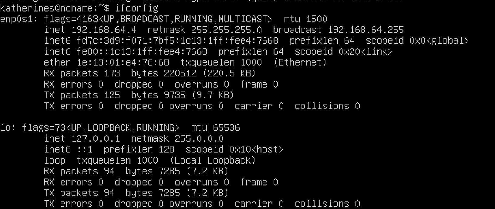
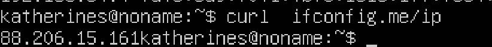
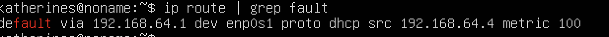
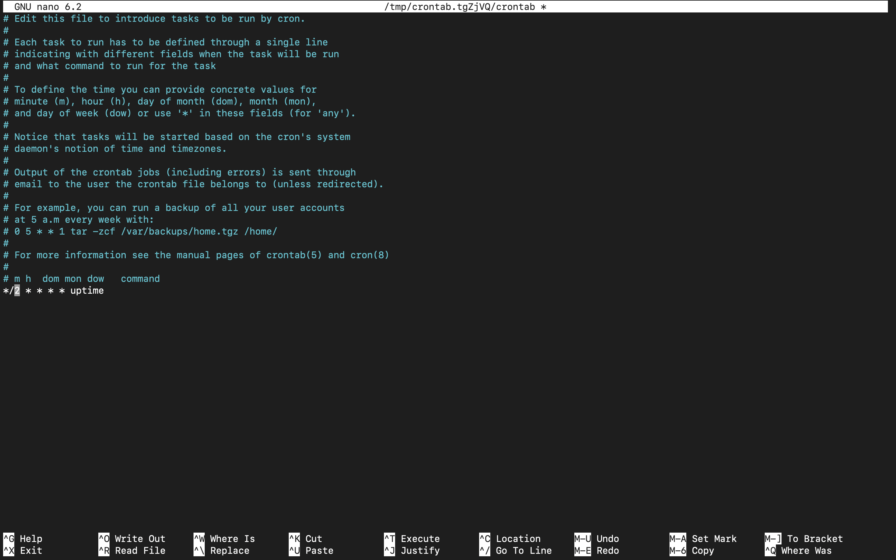

## Part 1. Установка ОС
**== Задание ==**

##### Установить **Ubuntu 20.04 Server LTS** без графического интерфейса. (Используем программу для виртуализации - VirtualBox)

- Графический интерфейс должен отсутствовать.

- Узнайте версию Ubuntu, выполнив команду \
`cat /etc/issue.`
- Вставьте скриншот с выводом команды.

**== Решение ==**
- ``Смотрим версию Ubuntu ``<br>
<br>


## Part 2. Создание пользователя

**== Задание ==**

##### Создать пользователя, отличного от пользователя, который создавался при установке. Пользователь должен быть добавлен в группу `adm`.

- Вставьте скриншот вызова команды для создания пользователя.
- Новый пользователь должен быть в выводе команды \
`cat /etc/passwd`
- Вставьте скриншот с выводом команды.

**== Решение ==**

- ``Создаём пользователя и добавляем в группу adm ``<br>
<br>

- ``Вывод списка пользователей ``<br>
<br>

## Part 3. Настройка сети ОС

**== Задание ==**

##### Задать название машины вида user-1  
##### Установить временную зону, соответствующую вашему текущему местоположению.  
##### Вывести названия сетевых интерфейсов с помощью консольной команды.
- В отчёте дать объяснение наличию интерфейса lo.  
##### Используя консольную команду получить ip адрес устройства, на котором вы работаете, от DHCP сервера. 
- В отчёте дать расшифровку DHCP.  
##### Определить и вывести на экран внешний ip-адрес шлюза (ip) и внутренний IP-адрес шлюза, он же ip-адрес по умолчанию (gw). 
##### Задать статичные (заданные вручную, а не полученные от DHCP сервера) настройки ip, gw, dns (использовать публичный DNS серверы, например 1.1.1.1 или 8.8.8.8).  
##### Перезагрузить виртуальную машину. Убедиться, что статичные сетевые настройки (ip, gw, dns) соответствуют заданным в предыдущем пункте.  

- В отчёте опишите, что сделали для выполнения всех семи пунктов (можно как текстом, так и скриншотами).
- Успешно пропинговать удаленные хосты 1.1.1.1 и ya.ru и вставить в отчёт скрин с выводом команды. В выводе команды должна быть фраза "0% packet loss".

**== Решение ==**

- ``Создание новой машины и вывод в терминал ``<br>
<br>

- ``Установка временной зоны и вывод информации``<br>
<br>

- ``Установка набора сетевых подключений``<br>
<br>
- ``Вывод названий сетевых интерфейсов``<br>
<br>

- Loopback-интерфейс (обычно обозначается как lo) в Linux - это своего рода виртуальный сетевой интерфейс, который всегда присутствует в системе. Его главное предназначение - обеспечивать внутреннюю коммуникацию на уровне сетевого стека на одном устройстве.С этим интерфейсом всегда связан адрес 127.0.0.1. У него есть dns-имя – localhost.

- ``Получение IP адреса от DHCP сервера``<br>
<br>

- DHCP- Dynamic Host Configuration Protocol (протокол динамической настройки узла, позволяющий устройствам автоматически получать IP-адрес)

- ``Получение внешнего IP``<br>
<br>

- ``Внутренний IP-адрес шлюза, ip-адрес по умолчанию``<br>
<br>

#### Настройка IP: 
- Зададим статичные (заданные вручную, а не полученные от DHCP сервера) настройки ip, gw, dns (используя публичные DNS серверы, например 1.1.1.1 или 8.8.8.8). DHCP автоматически присваивает устройству IP, поэтому сначала необходимо отключить облачную инициализацию. 

- ``1. Нужно открыть файл конфигурации subiquity-disable-cloudinit-networking.cfg в каталоге /etc/cloud/cloud.cfg.d/
``<br>
<br>

- ``2. Откроем файл конфигурации netplan в текстовом редакторе vim с помощью команды: sudo vim /etc/netplan/00-installer-config.yaml
``<br>
<br>

- `` Зададим статические настройки: изменим параметр dhcp4 на значение false, в addresses укажем статический IP-адрес: 192.168.1.45/24, и в gateway4 зададим внутренний IP-адрес 192.168.1.1. В параметре addresses раздела nameservers укажем публичные серверы. ``<br>
<br>

- ``Для применения изменений используем команду:``<br>
<br>

- ``Перезагрузим виртуальную машину командой reboot и проверяем сохранились ли выставленные вручную настройки:``<br>
<br>

- ``Пропингуем удаленные хосты 1.1.1.1 и ya.ru:``<br>
<br>
<br>


## Part 4. Обновление ОС
**== Задание ==**

##### Обновить системные пакеты до последней на момент выполнения задания версии.  

- После обновления системных пакетов, если ввести команду обновления повторно, должно появится сообщение, что обновления отсутствуют.
- Вставить скриншот с этим сообщением в отчёт.

**== Решение ==**


- `` Обновление системных пакеты до последней на момент выполнения задания версии.``<br>
- ``Команды : ``<br>
    ```
    sudo apt update
    sudo apt full-upgrade
    ```

- `` После обновления системных пакетов видим, что при повторном введении двух последних команд получены сообщения об отсутствии новых обновлений``<br>
<br>

## Part 5. Использование команды sudo
**== Задание ==**

##### Разрешить пользователю, созданному в [Part 2](#part-2-создание-пользователя), выполнять команду sudo.

- В отчёте объяснить *истинное* назначение команды sudo (про то, что это слово - "волшебное", писать не стоит).  
- Поменять hostname ОС от имени пользователя, созданного в пункте [Part 2](#part-2-создание-пользователя) (используя sudo).
- Вставить скрин с изменённым hostname в отчёт.

**== Решение ==**


- ``Разрешить пользователю, созданному в Part 2, выполнять команду sudo: ``<br>
- Sudo (от английского "superuser do") - это команда в операционной системе Linux, которая позволяет обычным пользователям выполнять команды с правами суперпользователя или другого пользователя, как правило, root. Суперпользователь в Linux имеет полные права на системе и может выполнять любые операции, в том числе изменение системных файлов и управление службами.

- ``Разрешим пользователю, созданному в Part 2, выполнять команду sudo. Для этого необходимо добавить пользователя newuser в группу sudo. Воспользуемся командой: ``<br>
    ```
   sudo usermod -a -G sudo newuser
    ```

- ``Проверим к каким группам принадлежит пользователь newuser с помощью команды:``<br>
<br>

- Поменяем hostname ОС от имени пользователя, созданного в пункте Part 2 (используя sudo). Для этого необходимо сменить текущего пользователя на ранее созданного с помощью команды:
    ```
   su имя пользователя
    ```
- `` Меняем hostname от имени пользователя, созданного ранее  ``<br>
<br>

## Part 6. Установка и настройка службы времени
**== Задание ==**

##### Настроить службу автоматической синхронизации времени.  

- Вывести время, часового пояса, в котором вы сейчас находитесь.
- Вывод следующей команды должен содержать `NTPSynchronized=yes`: \
  `timedatectl show`
- Вставить скрины с корректным временем и выводом команды в отчёт.

**== Решение ==**

- С помощью команды `date` выведем текущее время часового пояса, в котором мы находимся.

- ``Для вывода настроек часового пояса, используем команду: ` timedatectl show
`: ``<br>
<br>

- NTP (сетевой протокол времени) активен. NTP - это протокол, отвечающий за синхронизацию времени компьютера со стандартными эталонными часами через интернет с помощью серверов NTP.

## Part 7. Установка и использование текстовых редакторов 

##### Установить текстовые редакторы **VIM** (+ любые два по желанию **NANO**, **MCEDIT**, **JOE** и т.д.)  
##### Используя каждый из трех выбранных редакторов, создайте файл *test_X.txt*, где X -- название редактора, в котором создан файл. Напишите в нём свой никнейм, закройте файл с сохранением изменений.  
- В отчёт вставьте скриншоты:
- Из каждого редактора с содержимым файла перед закрытием.
- В отчёте укажите, что сделали для выхода с сохранением изменений.
##### Используя каждый из трех выбранных редакторов, откройте файл на редактирование, отредактируйте файл, заменив никнейм на строку "21 School 21", закройте файл без сохранения изменений.
- В отчёт вставьте скриншоты:
- Из каждого редактора с содержимым файла после редактирования.
- В отчёте укажите, что сделали для выхода без сохранения изменений.
##### Используя каждый из трех выбранных редакторов, отредактируйте файл ещё раз (по аналогии с предыдущим пунктом), а затем освойте функции поиска по содержимому файла (слово) и замены слова на любое другое.
- В отчёт вставьте скриншоты:
- Из каждого редактора с результатами поиска слова.
- Из каждого редактора с командами, введёнными для замены слова на другое.

**== Решение ==**
- Выполним установку текстовых редакторов командами:
    ```
    sudo apt install vim
    ```
    ```
    sudo apt install nano
    ```
    ```
    sudo apt install mcedit
    ```
---
### Запись никнейма в файлы и закрытие с сохранением

- `` VIM. Запишем никнейм , перейдя в режим редактирования нажатием клавиши i: `` <br>
<br>
- Для выхода с сохранением изменений нужно нажать ESC, затем написать :wq, что означает write and quit.

- ``NANO `` <br>
<br>

- Для выхода с сохранением изменений нужно нажать Ctrl+S и затем Ctrl+X.

- ``MCEDIT`` <br>
<br>

- Для выхода с сохранением изменений нужно нажать F2 и F10

### Запись "21 School 21" в файлы с выходом без сохранения

- `` VIM`` <br>
<br>

- Для выхода без сохранения нужно нажать ESC, затем написать :q!. 

- ``NANO `` <br>
<br>
- Для выхода без сохранения изменений нужно нажать Ctrl+X и подтвердить нажатием на N. 

- ``MCEDIT`` <br>
<br>
- Для выхода без сохранения изменений нужно нажать F10 и выбрать No


- `` Проверим, что изменения не сохранились: `` <br>
<br>

### Поиск по слову в файлах


- `` VIM`` <br>
- Поиск:
    `ESC + /<слово_для_поиска>`

<br>
   - Замена:
    `:s/<заменяемое>/<заменитель>`

<br>

- ``NANO `` <br>
    - Поиск:
    `Ctrl + W`
<br>
   - Замена:
    `Ctrl + \`
<br>

- ``MCEDIT`` <br>
    - Поиск:
    `F7`
<br>
   - Замена:
    `F4`
<br>

## Part 8. Установка и базовая настройка сервиса SSHD

- ``Установить службу SSHd`` <br>
```
sudo apt-get install ssh
sudo apt install openssh-server
```
<br>

- ``Добавление автостарта службы при загрузке системы.`` <br>
```
sudo systemctl enable ssh
systemctl status ssh
```
<br>

- ``Перенастройка службы SSHd на порт 2022`` <br>
```
sudo vim /etc/ssh/sshd_config
```
<br>
```
systemctl restart sshd - применение всех изменений
```
- ``Используя команду ps, показать наличие процесса sshd. Для этого к команде нужно подобрать ключи`` <br>
* ps (показывает запущенные процессы, выполняемые пользователем в окне терминала);
* ps -e или ps -A (Чтобы просмотреть все запущенные процессы);
* ps -d (Чтобы показать все процессы, кроме лидеров сессии);
* ps -d -N (можно инвертировать вывод с помощью переключателя -N. Например, если хочу вывести только лидеров сеансов)
* ps T (увидеть только процессы, связанные с этим терминалом);
* ps r (просмотреть все работающие (running) процессы);
* ps -p 'pid' (если вы знаете идентификатор процесса PID, вы можете просто использовать следующую команду, для вывода процесса с этим 'pid');
* ps -p 'pid1' 'pid2'
* ps U 'userlist' (найти все процессы, выполняемые конкретным пользователем);
* ps -ef (получить полный список); <br>
<br>

#### NETSTAT
- `` Вывод команды netstat -tan должен содержать
tcp 0 0 0.0.0.0:2022 0.0.0.0:* LISTEN `` <br>
<br>

* -t (--tcp) отображает соедниеня только по tcp
* -a (--all) вывод всех активных подключений TCP 
* -n (--numeric) вывод активных подключений TCP с отображением адресов и номеров портов в числовом формате
* Proto: Название протокола (протокол TCP или протокол UDP);
* recv-Q: очередь получения сети
* send-Q: Сетевая очередь отправки
* Local Address адрес локального компьтера и используемы номер порта
* Foreign Address адрес и номер удаленного компьтера к которомц подключен сокет
* State состояние сокетв
* 0.0.0.0 означает IP-адрес на локальной машине

## Part 9. Установка и использование утилит top, htop
- `` Установка и запуск утилит top и htop `` <br>
### TOP
  - uptime 38min
  - количество авторизованных пользователей - 2
  - общую загрузку системы -  0,00, 0,00, 0,00 (нет активных процессов)
  - общее количество процессов - 119.
  - загрузку cpu - 0,2% 
  - загрузку памяти - 159,8
  - pid процесса занимающего больше всего памяти - 1292
  - pid процесса, занимающего больше всего процессорного времени - Нет активных процессов.

### HTOP
- ``Вывод команды htop:`` <br>
    <br>

- ``Отсортированный по PID`` <br>
    <br>

- ``Отсортированный по PERCENT_CPU`` <br>
    <br>

- ``Отсортированный по PERCENT_MEM`` <br>\
    <br>

- ``Отсортированный по TIME`` <br>
    <br>

- ``Отфильтрованному для процесса sshd`` <br>
    <br>

- ``C процессом syslog, найденным, используя поиск `` <br>
    <br>


- ``C добавленным выводом hostname, clock и uptime  `` <br>
    <br>

## Part 10. Использование утилиты fdisk

- `` Запуск команды fdisk -l. `` <br>
    <br>

- Название: /dev/vda
- Размер: 64 GiB
- Количество секторов: 134217728
- Размер: 3,8 GiB
<br>

## Part 11. Использование утилиты df

- `` Запуск команды df `` <br>

* размер раздела - 31270768;
* размер занятого пространства - 7212652;
* размер свободного пространства - 22444088;
* процент использования - 25%;   
* килобайты

- `` Запуск команды df -Th `` <br>

* размер раздела - 30G;
* размер занятого пространства -  6,9G;
* размер свободного пространства - 22G;
* процент использования  - 25%  <br>
<br>

## Part 12. Использование утилиты du
- df - не единственный способ получить информацию о дисковом пространстве. Сейчас расскажу про ещё один.
- `` Запуск команды du `` <br>
<br>

- `` Размер папок /home, /var, /var/log (в байтах)`` <br>
<br>

- `` Размер папок /home, /var, /var/log (в человекочитаемом виде) `` <br>
<br>

- `` Вывести размер всего содержимого в /var/log (не общее, а каждого вложенного элемента, используя *)`` <br>
<br>

## Part 13. Установка и использование утилиты ncdu

- `` Установка утилиты ncdu командой  sudo apt-get install ncdu`` <br>
-   `Вывести размер папок /home.`
<br>
-   `Вывести размер папок  /var`
<br>
-   `Вывести размер папок  /var/log`
<br>

## Part 14. Работа с системными журналами

cat /var/log/dmesg
cat /var/log/syslog
cat /var/log/auth.log

- `TTY=pts/0 указывает на то, что операция производится в псевдотерминале (pseudo-terminal) ` <br>
<br>

- `sudo systemctl restart ssh -  В данном случае, система начала процесс остановки, успешно деактивировала службу SSH, остановила ее, а затем успешно запустила снова.` <br>
<br>


## Part 15. Использование планировщика заданий CRON
- `Используя планировщик задач, запустим команду uptime через каждые 2 минуты` <br>
<br>

- `Нашли в логах (минимум две в заданном временном диапазоне) о выполнении.` <br>
<br>
- `Вывели список задач`
<br>


- 